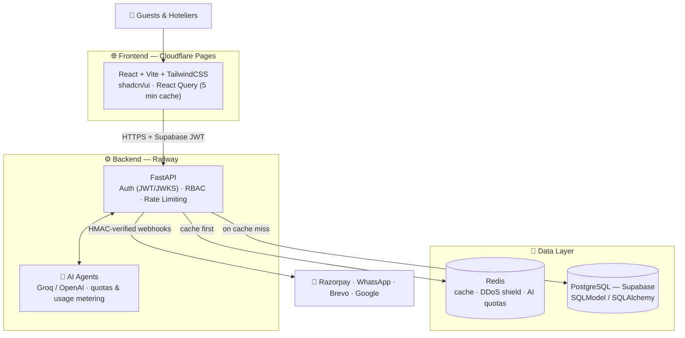

# 🏨 Staybooker — AI-Powered Hotel Booking Engine

> A production-grade, **multi-tenant hotel booking SaaS** — think of it as a private Booking.com that any hotel can run for itself. Built with FastAPI, React, PostgreSQL, Redis, and LLM-powered agents, handling **real payments** and **real guest data** with bank-level security discipline.


-8A2BE2)


---

## ✨ What Is Staybooker?

Staybooker gives every hotel its own **direct booking website**, a full **management dashboard**, and an **AI sales agent** — with zero commission to OTAs.

**Three products in one codebase:**

| Product | Who uses it | What it does |
|---|---|---|
| 🌐 **Public Booking Engine** | Guests (no login) | Browse rooms, live availability, pay via Razorpay, instant confirmation |
| 🖥️ **Hotelier Admin Panel** | Hotel owners, managers, staff | Bookings, rooms, pricing, revenue, guests, marketing, analytics |
| 🛡️ **Super Admin Console** | Platform team | Manage all hotels, plans, quotas, and platform health |

**Strictly multi-tenant:** every query is scoped by `hotel_id`. Hotel A can never see Hotel B's bookings, guests, or revenue — enforced at the API layer and covered by IDOR tests.

---

## 🚀 Feature Highlights

### 🤖 AI Layer
- **AI Sales Agent** — guest-facing chatbot that answers questions, checks availability, and drives bookings on the public site
- **Hotelier Analytics Agent** — natural-language analytics over the hotel's own data ("What was my occupancy last weekend?")
- **Cost-bounded by design** — per-hotel AI quotas, token caps, tool-call limits, response caching, and usage tracking on every run (LLM billing can never run away)
- **Human-in-the-loop safety** — destructive agent actions require explicit confirmation before execution

### 💰 Revenue & Distribution
- **Dynamic rate plans** and calendar-based pricing (bulk updates, weekend rules, copy-across-dates)
- **Rate Shopper** — track competitor pricing
- **Channel Manager** — sync availability/rates with external channels
- **Revenue dashboard** — occupancy, ADR, RevPAR-style analytics with charts

### 🛎️ Operations
- Bookings lifecycle (create, modify, cancel, no-show) with server-computed pricing — the client's `total_amount` is **never** trusted
- Room & inventory management with availability blocks
- Guest CRM, loyalty programs, offers, and marketing leads
- Experiences/add-ons upselling
- WhatsApp, transactional email (Brevo), and Google Reviews integrations
- Booking confirmation PDFs, multi-language UI (i18next)

### 💳 Payments
- Razorpay checkout with **HMAC SHA-256 verified webhooks**
- **Idempotent webhook handlers** — retried deliveries can never double-charge or double-book
- All amounts recomputed server-side

---

## 🏗️ Architecture



### Engineering decisions worth noticing

- **Multi-layered caching** — React Query on the client, Redis on the server, per-route cache keys for public endpoints. If Redis goes down, a built-in **in-memory fallback cache** takes over transparently — the app degrades, it never crashes.
- **Design-for-failure** — every external call (DB, Redis, LLM, Razorpay, WhatsApp) has a timeout and a fallback path.
- **Defense in depth** — JWT verification against Supabase JWKS, role-based access control (`OWNER` / `MANAGER` / `STAFF`), per-IP + per-hotel rate limits, secret masking on API responses, HMAC-verified webhooks.
- **Expand-contract migrations** — schema changes ship in backward-compatible steps so old and new code deploy side by side with zero downtime.
- **Cost-bounded everything** — paginated list endpoints, indexed hot columns, no N+1 queries (`selectinload` / `GROUP BY`), lazy imports for heavy libraries, capped LLM spend.

---

## 🧰 Tech Stack

| Layer | Technology |
|---|---|
| **Frontend** | React 18, TypeScript, Vite, TailwindCSS, shadcn/ui (Radix), React Query, react-hook-form + zod, Recharts, Framer Motion, i18next, jsPDF |
| **Backend** | Python, FastAPI, SQLModel/SQLAlchemy (async), Pydantic, Alembic, APScheduler, Gunicorn/Uvicorn |
| **AI** | Agno agent framework, Groq (`llama-3.1-8b-instant`) + OpenAI, per-hotel quotas & usage metering |
| **Data** | PostgreSQL (Supabase), Redis (cache, rate limiting, DDoS protection) |
| **Auth** | Supabase Auth (JWT + JWKS verification), custom RBAC |
| **Payments** | Razorpay (orders, webhooks, refunds) |
| **Integrations** | WhatsApp Business, Brevo email, Google Reviews, Cloudflare Turnstile |
| **Observability** | Sentry (backend + frontend) |
| **Deploy** | Cloudflare Pages (frontend), Railway (backend + Redis), Docker |

---

## 📁 Project Structure

```
├── backend/
│   ├── app/
│   │   ├── core/            # auth deps, RBAC, Redis client, rate limiter, config, secret masking
│   │   ├── bookings/        # one folder per business domain —
│   │   ├── rooms/           # each owns its routes, models, and schemas
│   │   ├── payments/
│   │   ├── guest_booking/   # public booking engine APIs
│   │   ├── ai_assistant/    # guest-facing AI sales agent
│   │   ├── ai_engine/       # hotelier analytics agent
│   │   ├── revenue/  rate_plans/  rate_shopper/  channel_manager/
│   │   ├── loyalty/  marketing/  analytics/  experiences/
│   │   ├── integration/     # WhatsApp, email, Google
│   │   └── superadmin/  brand_console/  ...
│   └── tests/               # async API tests: auth, IDOR, contracts, regressions
├── frontend/
│   └── src/                 # domain folders mirror the backend 1:1
├── landing/                 # marketing site
├── docs/  STAYBOOKER_DOCS.md  SECURITY.md
└── Dockerfile
```

---

## ⚡ Quick Start

### Backend

```bash
cd backend
pip install -r requirements.txt
# set env vars (Supabase, Redis, Razorpay, Groq…) — see app/core/config.py
uvicorn main:app --reload          # API on http://localhost:8000
pytest                             # run the test suite
```

### Frontend

```bash
cd frontend
npm install
npm run dev                        # app on http://localhost:5173
npm run test                       # vitest
npm run build                      # production build + typecheck
```

---

## 🧪 Quality & Testing Culture

This repo enforces a **no-endpoint-ships-without-a-test** policy. Every endpoint carries at minimum:

1. 🔒 **Auth guard test** — unauthenticated requests are rejected
2. ✅ **Happy path test** — asserts every field the frontend actually reads
3. 🏢 **Tenant-isolation (IDOR) test** — Hotel A can't touch Hotel B's data
4. 🕳️ **Empty-state test** — endpoints never 500 on an empty database
5. 🧾 **Tamper test** — client-supplied prices, roles, and IDs are ignored server-side

Bug fixes follow a **regression-test-first** protocol: write the failing test, then fix the code, commit both together. Frontend/backend API contracts are audited on every change so a renamed field can never silently break the UI.

---

## 🔐 Security Posture

- ✅ Strict tenant isolation on every DB query (`hotel_id` scoping)
- ✅ JWT verified against Supabase JWKS on every non-public route
- ✅ RBAC with role hierarchy + platform-level superadmin permissions
- ✅ Server-side computation of all money amounts
- ✅ HMAC SHA-256 signature verification for all webhooks
- ✅ Idempotent payment/webhook processing
- ✅ API keys and secrets masked in all responses; no secrets in code, logs, or Sentry
- ✅ Redis-backed rate limiting + DDoS protection + AI quota enforcement

See [`SECURITY.md`](SECURITY.md) for the full policy and [`STAYBOOKER_DOCS.md`](STAYBOOKER_DOCS.md) for complete platform documentation.

---

## 📚 Documentation

| Doc | What's inside |
|---|---|
| [`STAYBOOKER_DOCS.md`](STAYBOOKER_DOCS.md) | Full A-to-Z platform docs: DB tables, all API endpoints, deployment, debugging |
| [`SECURITY.md`](SECURITY.md) | Security policy |
| [`CHANGELOG.md`](CHANGELOG.md) | Release history |
| [`CLAUDE.md`](CLAUDE.md) | Engineering rules, testing policy, and production discipline |

---

<p align="center">
  <b>Staybooker</b> — direct bookings, zero commission, AI inside. 🏨✨
</p>
