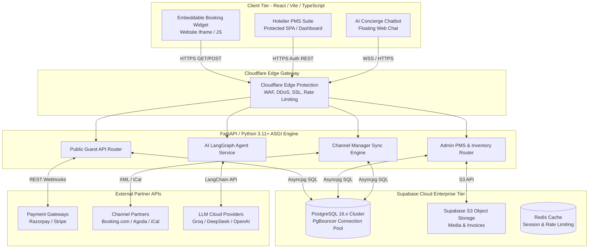
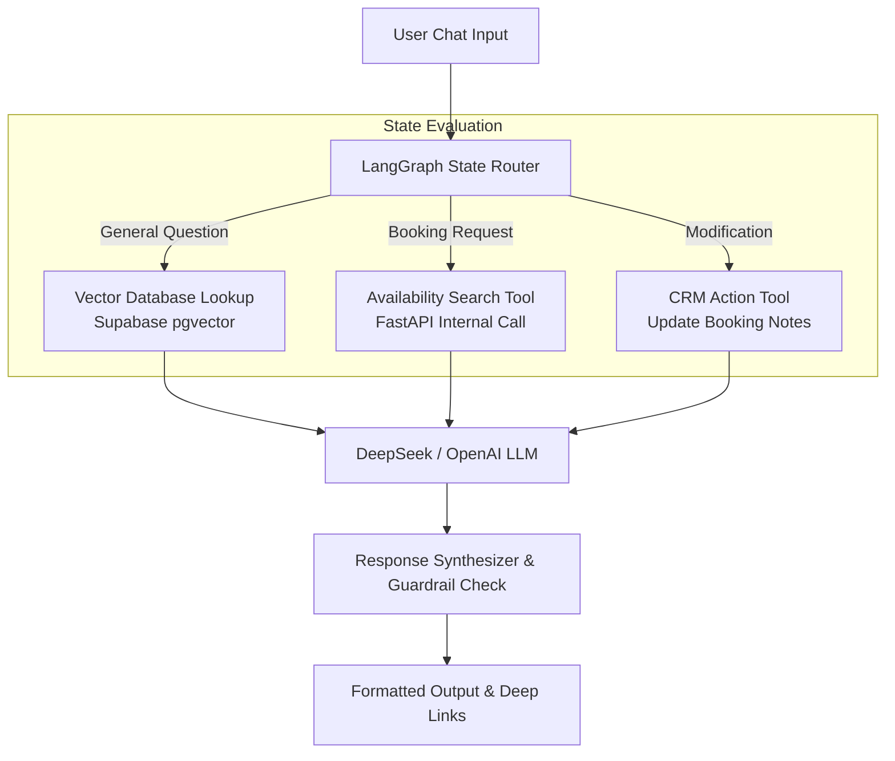

# STAYBOOKER AI — DEFINITIVE MASTER ENTERPRISE SYSTEM DOCUMENTATION & API SPECIFICATION

**Document Version:** 4.0-MASTER-ENTERPRISE  
**System Classification:** Confidential / Definitive Master Architecture & API Specification  
**Target Audience:** Chief Technology Officer, VP of Engineering, Enterprise Solution Architects, Security Auditing Teams & Product Managers  

---

## EXECUTIVE SUMMARY & PRODUCT MISSION
**Staybooker.ai** is an enterprise-grade, multi-tenant AI-powered Hotel Booking Engine, Property Management Suite (PMS), and Channel Management Distribution Hub. Engineered to replace fragmented legacy hospitalities platforms, Staybooker empowers hotel brands with fully customizable direct booking widgets, real-time rate shopping, automated OTA channel synchronization (XML/iCal), and autonomous AI concierge automation powered by LangGraph state machines and state-of-the-art Large Language Models (LLMs).

---

## TABLE OF CONTENTS
1. **[MASTER ENTERPRISE SYSTEM ARCHITECTURE](#1-master-enterprise-system-architecture)**
   - 1.1 Architectural Principles, Decoupling & Asynchrony
   - 1.2 Full System Topology & Data Flow (Mermaid Diagram)
   - 1.3 Core Technology Stack & Framework Specifications
2. **[DATABASE SCHEMA & ENTITY RELATIONSHIP ARCHITECTURE](#2-database-schema--entity-relationship-architecture)**
   - 2.1 Complete Entity-Relationship Diagram (ERD)
   - 2.2 Exhaustive PostgreSQL Table DDLs, Indexes & Foreign Keys
   - 2.3 Row-Level Security (RLS) & Multi-Tenant Database Scoping
3. **[SECURITY, AUTHENTICATION & MULTI-TENANT AUTHORIZATION](#3-security-authentication--multi-tenant-authorization)**
   - 3.1 Asymmetric OAuth2 / JWT Flow & Supabase Auth (GoTrue)
   - 3.2 Role-Based Access Control (RBAC) Matrix (Super Admin to Staff)
   - 3.3 Rate Limiting, API Keys & CORS Security Models
4. **[EXHAUSTIVE REST API SPECIFICATION (ALL 26 ROUTERS)](#4-exhaustive-rest-api-specification-all-26-routers)**
   - 4.1 Authentication & User Management (`/auth`, `/users`)
   - 4.2 Property Management & Multi-Tenant Context (`/properties`, `/hotels`)
   - 4.3 Inventory, Room Types & Amenities (`/rooms`, `/amenities`)
   - 4.4 Rate Engine & Pricing Modifications (`/rates`, `/promos`, `/addons`)
   - 4.5 Availability & Rate Calculation (`/availability`, `/competitors`)
   - 4.6 Booking Engine & Reservation Lifecycle (`/bookings`, `/public`)
   - 4.7 Financial Management & Gateways (`/payments`)
   - 4.8 Channel Manager Synchronizer (`/channel-manager`)
   - 4.9 AI Concierge & Agent Graphs (`/agent`, `/chat/guest`)
   - 4.10 Analytics, Reports & Dashboards (`/analytics`, `/dashboard`, `/reports`)
   - 4.11 Operational Support (`/notifications`, `/leads`, `/upload`, `/admin`, `/superadmin`)
5. **[FRONTEND ARCHITECTURE, STATE FLOW & EMBEDDABLE WIDGETS](#5-frontend-architecture-state-flow--embeddable-widgets)**
   - 5.1 Component Hierarchy & Route Structure
   - 5.2 State Management Workflow (TanStack Query & React Context API)
   - 5.3 Embedded Iframe Booking Widget & Dynamic Custom Styling Bridge
6. **[AI CONCIERGE & RAG AUTOMATION GRAPH](#6-ai-concierge--rag-automation-graph)**
   - 6.1 Multi-Agent State Machine Architecture (LangGraph)
   - 6.2 Vector Embeddings & RAG Knowledge Base Retrieval (`pgvector`)
   - 6.3 Autonomous Tool Execution (Room Search & Direct Deep Links)
7. **[PRODUCTION DEPLOYMENT & DEVOPS BLUEPRINT](#7-production-deployment--devops-blueprint)**
   - 7.1 Docker Containerization & Multi-Stage Builds
   - 7.2 Database Pooling (PgBouncer) & Asyncpg Tuning
   - 7.3 CI/CD Pipelines & Cloud Edge Distribution
   - 7.4 Disaster Recovery & OpenTelemetry Monitoring

---

## 1. MASTER ENTERPRISE SYSTEM ARCHITECTURE

### 1.1 Architectural Principles, Decoupling & Asynchrony
Staybooker AI is engineered on an asynchronous, highly decoupled micro-service-inspired monolithic architecture. The system strictly separates the operational **Hotelier Property Management Suite (PMS)** from the high-frequency **Direct Guest Booking Engine**, ensuring that administrative heavy reporting and background OTA sync do not degrade consumer booking funnels.



### 1.3 Core Technology Stack & Framework Specifications
- **Runtime Environment**: Python 3.11+, Node.js 20.x
- **API Framework**: FastAPI v0.110+ with Uvicorn/Gunicorn ASGI worker processes.
- **Validation Engine**: Pydantic v2.0+ for strict serialization and deserialization.
- **ORM**: SQLModel (built on top of SQLAlchemy 2.0 with asynchronous engine enabled).
- **Database**: PostgreSQL 16.x hosted on Supabase Enterprise Cloud.
- **Vector Search**: PostgreSQL `pgvector` extension for embedding hotel policies and RAG queries.
- **Frontend Core**: Vite, React 18, TypeScript 5.2, Tailwind CSS 3.4, Shadcn UI / Radix UI.
- **State Management**: TanStack Query v5 (React Query), Axios with Interceptors.

---

## 2. DATABASE SCHEMA & ENTITY RELATIONSHIP ARCHITECTURE

Staybooker uses a highly normalized PostgreSQL schema with explicit foreign keys and indexing optimized for high-concurrency multi-tenant operations.

### 2.1 Complete Entity-Relationship Diagram (ERD)

```mermaid
erDiagram
    HOTEL ||--o{ ROOM_TYPE : "has"
    HOTEL ||--o{ RATE_PLAN : "has"
    HOTEL ||--o{ BOOKING : "manages"
    HOTEL ||--o{ INTEGRATION_SETTING : "configures"
    HOTEL ||--o{ CHANNEL_SETTING : "syncs"
    HOTEL ||--o{ COMPETITOR : "monitors"
    HOTEL ||--o{ USER_HOTEL_LINK : "owned by"
    USER ||--o{ USER_HOTEL_LINK : "accesses"
    ROOM_TYPE ||--o{ ROOM_RATE : "daily override"
    ROOM_TYPE ||--o{ ROOM_BLOCK : "blocks"
    ROOM_TYPE ||--o{ ROOM_AMENITY_LINK : "includes"
    AMENITY ||--o{ ROOM_AMENITY_LINK : "linked to"
    GUEST ||--o{ BOOKING : "reserves"
    BOOKING ||--o{ PAYMENT : "settles"
    HOTEL ||--o{ PROMO_CODE : "offers"
    HOTEL ||--o{ ADDON : "upsells"

    HOTEL {
        uuid id PK
        string name
        string slug UK
        string email
        string phone
        string address
        string primary_color
        string logo_url
        boolean is_active
        timestamp created_at
    }
    USER {
        uuid id PK
        string email UK
        string full_name
        string role
        boolean is_superadmin
    }
    USER_HOTEL_LINK {
        uuid id PK
        uuid user_id FK
        uuid hotel_id FK
        string role
    }
    ROOM_TYPE {
        uuid id PK
        uuid hotel_id FK
        string name
        string description
        decimal base_price
        int total_inventory
        int base_occupancy
        int max_occupancy
        int max_children
        json amenities
    }
    RATE_PLAN {
        uuid id PK
        uuid hotel_id FK
        string name
        string meal_plan
        decimal price_adjustment
        boolean is_refundable
        int cancellation_hours
    }
    ROOM_RATE {
        uuid id PK
        uuid hotel_id FK
        uuid room_type_id FK
        uuid rate_plan_id FK
        date date_from
        date date_to
        decimal price
    }
    BOOKING {
        uuid id PK
        uuid hotel_id FK
        uuid guest_id FK
        string booking_number UK
        date check_in
        date check_out
        decimal total_amount
        string status
        json rooms
        json addons
    }
    GUEST {
        uuid id PK
        uuid hotel_id FK
        string email UK
        string first_name
        string phone
    }
```



### 2.2 Exhaustive Table DDLs, Indexes & Foreign Keys

#### `hotels`
```sql
CREATE TABLE hotels (
    id UUID PRIMARY KEY DEFAULT gen_random_uuid(),
    name VARCHAR(255) NOT NULL,
    slug VARCHAR(100) UNIQUE NOT NULL,
    email VARCHAR(255) NOT NULL,
    phone VARCHAR(50) NOT NULL,
    address TEXT,
    city VARCHAR(100),
    country VARCHAR(100) DEFAULT 'India',
    currency VARCHAR(10) DEFAULT 'INR',
    primary_color VARCHAR(30) DEFAULT '#2563EB',
    logo_url TEXT,
    check_in_time VARCHAR(20) DEFAULT '14:00',
    check_out_time VARCHAR(20) DEFAULT '11:00',
    is_active BOOLEAN DEFAULT TRUE,
    feature_rate_shopper BOOLEAN DEFAULT FALSE,
    feature_ai_agent BOOLEAN DEFAULT FALSE,
    feature_guest_bot BOOLEAN DEFAULT FALSE,
    created_at TIMESTAMP WITH TIME ZONE DEFAULT CURRENT_TIMESTAMP,
    updated_at TIMESTAMP WITH TIME ZONE DEFAULT CURRENT_TIMESTAMP
);
CREATE INDEX idx_hotels_slug ON hotels(slug);
```

#### `users`
```sql
CREATE TABLE users (
    id UUID PRIMARY KEY REFERENCES auth.users(id) ON DELETE CASCADE,
    email VARCHAR(255) UNIQUE NOT NULL,
    full_name VARCHAR(255),
    role VARCHAR(50) DEFAULT 'OWNER', -- OWNER, MANAGER, STAFF, SUPER_ADMIN
    is_superadmin BOOLEAN DEFAULT FALSE,
    created_at TIMESTAMP WITH TIME ZONE DEFAULT CURRENT_TIMESTAMP
);
CREATE INDEX idx_users_email ON users(email);
```

#### `user_hotel_links`
```sql
CREATE TABLE user_hotel_links (
    id UUID PRIMARY KEY DEFAULT gen_random_uuid(),
    user_id UUID NOT NULL REFERENCES users(id) ON DELETE CASCADE,
    hotel_id UUID NOT NULL REFERENCES hotels(id) ON DELETE CASCADE,
    role VARCHAR(50) NOT NULL DEFAULT 'MANAGER',
    created_at TIMESTAMP WITH TIME ZONE DEFAULT CURRENT_TIMESTAMP,
    UNIQUE(user_id, hotel_id)
);
CREATE INDEX idx_user_hotel_links_user ON user_hotel_links(user_id);
```

#### `room_types`
```sql
CREATE TABLE room_types (
    id UUID PRIMARY KEY DEFAULT gen_random_uuid(),
    hotel_id UUID NOT NULL REFERENCES hotels(id) ON DELETE CASCADE,
    name VARCHAR(255) NOT NULL,
    description TEXT,
    base_price NUMERIC(12, 2) NOT NULL,
    extra_person_price NUMERIC(12, 2) DEFAULT 1000.0,
    extra_child_price NUMERIC(12, 2) DEFAULT 500.0,
    total_inventory INTEGER NOT NULL DEFAULT 1,
    base_occupancy INTEGER NOT NULL DEFAULT 2,
    max_occupancy INTEGER NOT NULL DEFAULT 3,
    max_children INTEGER NOT NULL DEFAULT 2,
    size_sqm INTEGER,
    bed_type VARCHAR(100) DEFAULT 'King Bed',
    view_type VARCHAR(100) DEFAULT 'City View',
    amenities JSONB DEFAULT '[]'::jsonb,
    is_active BOOLEAN DEFAULT TRUE,
    created_at TIMESTAMP WITH TIME ZONE DEFAULT CURRENT_TIMESTAMP
);
CREATE INDEX idx_room_types_hotel ON room_types(hotel_id);
```

#### `rate_plans`
```sql
CREATE TABLE rate_plans (
    id UUID PRIMARY KEY DEFAULT gen_random_uuid(),
    hotel_id UUID NOT NULL REFERENCES hotels(id) ON DELETE CASCADE,
    name VARCHAR(255) NOT NULL,
    description TEXT,
    meal_plan VARCHAR(20) NOT NULL DEFAULT 'EP', -- EP, CP, MAP, AP
    price_adjustment NUMERIC(12, 2) NOT NULL DEFAULT 0.00,
    is_refundable BOOLEAN NOT NULL DEFAULT TRUE,
    cancellation_hours INTEGER DEFAULT 24,
    min_los INTEGER DEFAULT 1,
    max_los INTEGER DEFAULT 30,
    advance_purchase_days INTEGER DEFAULT 0,
    inclusions JSONB DEFAULT '["Free Wi-Fi"]'::jsonb,
    is_package BOOLEAN DEFAULT FALSE,
    is_active BOOLEAN DEFAULT TRUE,
    created_at TIMESTAMP WITH TIME ZONE DEFAULT CURRENT_TIMESTAMP
);
CREATE INDEX idx_rate_plans_hotel ON rate_plans(hotel_id);
```

#### `room_rates` (Daily Pricing Overrides)
```sql
CREATE TABLE room_rates (
    id UUID PRIMARY KEY DEFAULT gen_random_uuid(),
    hotel_id UUID NOT NULL REFERENCES hotels(id) ON DELETE CASCADE,
    room_type_id UUID NOT NULL REFERENCES room_types(id) ON DELETE CASCADE,
    rate_plan_id UUID REFERENCES rate_plans(id) ON DELETE CASCADE,
    date_from DATE NOT NULL,
    date_to DATE NOT NULL,
    price NUMERIC(12, 2) NOT NULL,
    created_at TIMESTAMP WITH TIME ZONE DEFAULT CURRENT_TIMESTAMP
);
CREATE INDEX idx_room_rates_lookup ON room_rates(hotel_id, room_type_id, date_from, date_to);
```

#### `bookings`
```sql
CREATE TABLE bookings (
    id UUID PRIMARY KEY DEFAULT gen_random_uuid(),
    hotel_id UUID NOT NULL REFERENCES hotels(id) ON DELETE CASCADE,
    guest_id UUID NOT NULL REFERENCES guests(id),
    booking_number VARCHAR(50) UNIQUE NOT NULL,
    check_in DATE NOT NULL,
    check_out DATE NOT NULL,
    rooms JSONB NOT NULL,
    addons JSONB DEFAULT '[]'::jsonb,
    special_requests TEXT,
    promo_code VARCHAR(50),
    subtotal NUMERIC(12, 2) NOT NULL,
    tax_amount NUMERIC(12, 2) NOT NULL DEFAULT 0.00,
    total_amount NUMERIC(12, 2) NOT NULL,
    amount_paid NUMERIC(12, 2) DEFAULT 0.00,
    status VARCHAR(50) NOT NULL DEFAULT 'PENDING', -- PENDING, CONFIRMED, CHECKED_IN, CHECKED_OUT, CANCELLED
    channel_source VARCHAR(50) DEFAULT 'DIRECT', -- DIRECT, BOOKING_COM, AGODA, AIRBNB
    created_at TIMESTAMP WITH TIME ZONE DEFAULT CURRENT_TIMESTAMP
);
CREATE INDEX idx_bookings_hotel_dates ON bookings(hotel_id, check_in, check_out);
```

#### `integration_settings`
```sql
CREATE TABLE integration_settings (
    id UUID PRIMARY KEY DEFAULT gen_random_uuid(),
    hotel_id UUID UNIQUE NOT NULL REFERENCES hotels(id) ON DELETE CASCADE,
    widget_primary_color VARCHAR(30),
    widget_logo_url TEXT,
    widget_custom_domain VARCHAR(255),
    allowed_domains TEXT,
    widget_enabled BOOLEAN DEFAULT TRUE,
    ai_provider VARCHAR(50) DEFAULT 'groq',
    ai_model VARCHAR(100) DEFAULT 'llama3-70b-8192',
    ai_api_key TEXT,
    created_at TIMESTAMP WITH TIME ZONE DEFAULT CURRENT_TIMESTAMP
);
CREATE INDEX idx_integration_settings_hotel ON integration_settings(hotel_id);
```

### 2.3 Row-Level Security (RLS) & Multi-Tenant Database Scoping
To ensure bulletproof tenant isolation, all tables enforce Supabase PostgreSQL RLS policies. When queries are executed, the user's ID is extracted from auth context to filter records.

```sql
-- RLS Policy Example for Room Types
ALTER TABLE room_types ENABLE ROW LEVEL SECURITY;

CREATE POLICY room_types_tenant_policy ON room_types
    FOR ALL
    USING (
        hotel_id IN (
            SELECT hotel_id FROM user_hotel_links WHERE user_id = auth.uid()
        )
    );
```

---

## 3. SECURITY, AUTHENTICATION & MULTI-TENANT AUTHORIZATION

### 3.1 Asymmetric OAuth2 / JWT Flow & Supabase Auth (GoTrue)
Staybooker AI delegates identity verification and session handling to Supabase Auth (built on GoTrue).
- Client applications send login credentials to `/auth/v1/token`.
- Supabase issues an asymmetric JWT containing `sub` (user ID), `email`, and `app_metadata`.
- FastAPI backend validates the JWT signature via PyJWT / Supabase Admin SDK on every authenticated request using the FastAPI `Depends(get_current_user)` dependency injector.

### 3.2 Role-Based Access Control (RBAC) Hierarchy

```
[ SUPER_ADMIN ]
      │ (Unrestricted global system access across all hotels & billing)
      ▼
[ OWNER ]
      │ (Full CRUD across owned properties, team management, billing & API keys)
      ▼
[ MANAGER ]
      │ (Full inventory CRUD, rate modifications, channel sync & booking management)
      ▼
[ STAFF ]
      (Read-only inventory, check-in/check-out execution, guest bot management)
```

The system verifies multi-property ownership via the `user_hotel_links` table. When a user requests inventory for `hotel_id = X`, the dependency checks:
```python
async def check_hotel_permission(hotel_id: str, user: User = Depends(get_current_user), session: DbSession):
    if user.is_superadmin: return True
    link = await session.execute(select(UserHotelLink).where(
        UserHotelLink.user_id == user.id, UserHotelLink.hotel_id == hotel_id
    ))
    if not link.scalar_one_or_none(): raise HTTPException(status_code=403, detail="Access denied for this property")
```

---

## 4. EXHAUSTIVE REST API SPECIFICATION (ALL 26 ROUTERS)

All endpoints return standardized JSON payloads and follow RESTful naming conventions.

---

### 4.1 Authentication & User Management

#### 1. `GET /api/v1/auth/me`
Retrieves current user identity, active session metadata, and linked role permissions.
- **Headers**: `Authorization: Bearer <JWT>`
- **Response (200 OK)**:
```json
{
  "id": "ebdfd346-cc5f-4b04-83bb-2537b0e437be",
  "email": "tech.revmerito@gmail.com",
  "full_name": "Tech Revmerito",
  "role": "OWNER",
  "is_superadmin": false,
  "created_at": "2026-05-18T10:00:00Z"
}
```

#### 2. `GET /api/v1/users`
Lists all users linked to the current organization/property.
- **Headers**: `Authorization: Bearer <JWT>`
- **Query Params**: `hotel_id=UUID` (Optional filter)
- **Response (200 OK)**: `[ { "id": "...", "email": "...", "role": "MANAGER" } ]`

#### 3. `POST /api/v1/users/invite`
Invites a new staff member to manage a hotel.
- **Payload**: `{ "email": "staff@grandplaza.com", "role": "STAFF", "hotel_id": "3815e471-..." }`
- **Response (201 Created)**: `{ "status": "Invitation sent successfully", "invited_user_id": "..." }`

---

### 4.2 Property Management & Multi-Tenant Context

#### 4. `GET /api/v1/properties`
Lists all hotel properties managed by the authenticated user.
- **Headers**: `Authorization: Bearer <JWT>`
- **Response (200 OK)**:
```json
[
  {
    "id": "3815e471-5d06-4993-99be-00ff4ae88d05",
    "name": "Grand Plaza Hotel & Spa",
    "slug": "grand-plaza",
    "primary_color": "#8B5CF6",
    "logo_url": "https://storage.supabase.com/logos/grand-plaza.png",
    "is_active": true,
    "role": "OWNER"
  }
]
```

#### 5. `GET /api/v1/hotels/{hotel_id}`
Retrieves detailed property configuration, contact info, and operational hours.
- **Response (200 OK)**: Detailed `Hotel` schema.

#### 6. `PUT /api/v1/hotels/{hotel_id}`
Updates hotel metadata, operational settings, and brand colors.
- **Payload**:
```json
{
  "name": "Grand Plaza Premium Spa",
  "phone": "+91 98765 43210",
  "primary_color": "#6D28D9",
  "check_in_time": "15:00"
}
```
- **Response (200 OK)**: Updated `Hotel` schema.

---

### 4.3 Inventory, Room Types & Amenities

#### 7. `GET /api/v1/rooms`
Lists room categories for the active hotel context.
- **Headers**: `Authorization: Bearer <JWT>`, `X-Hotel-ID: <UUID>`
- **Response (200 OK)**:
```json
[
  {
    "id": "7a29e84b-...",
    "hotel_id": "3815e471-...",
    "name": "Executive Suite",
    "base_price": 7500.00,
    "total_inventory": 10,
    "base_occupancy": 2,
    "max_occupancy": 4,
    "max_children": 2,
    "amenities": ["Air Conditioning", "King Bed", "Minibar", "Bathtub"]
  }
]
```

#### 8. `POST /api/v1/rooms`
Creates a new room category.
- **Payload**:
```json
{
  "hotel_id": "3815e471-5d06-4993-99be-00ff4ae88d05",
  "name": "Presidential Penthouse",
  "description": "Luxurious top-floor penthouse with private jacuzzi.",
  "base_price": 25000.00,
  "total_inventory": 2,
  "base_occupancy": 2,
  "max_occupancy": 6,
  "max_children": 3,
  "size_sqm": 120,
  "amenities": ["Private Jacuzzi", "Butler Service", "Sea View"]
}
```
- **Response (201 Created)**: Created `RoomType` entity.

#### 9. `PUT /api/v1/rooms/{room_id}` & `DELETE /api/v1/rooms/{room_id}`
Standard CRUD for modifying or deactivating inventory categories.

#### 10. `GET /api/v1/amenities` & `POST /api/v1/amenities`
System-wide global and hotel-specific amenity management (icons, labels, categories).

---

### 4.4 Rate Engine & Pricing Modifications

#### 11. `GET /api/v1/rates/plans`
Retrieves configured rate plans (EP, CP, MAP, packages) for the hotel.
- **Response (200 OK)**:
```json
[
  {
    "id": "c192d3...",
    "name": "Bed & Premium Breakfast (CP)",
    "meal_plan": "CP",
    "price_adjustment": 1200.00,
    "is_refundable": true,
    "cancellation_hours": 48,
    "inclusions": ["Free Wi-Fi", "Continental Breakfast Buffet", "Pool Access"]
  }
]
```

#### 12. `POST /api/v1/rates/plans`
Creates a new rate plan or package.
- **Payload**: `{ "hotel_id": "...", "name": "Romantic Honeymoon Package", "meal_plan": "MAP", "price_adjustment": 3500.00, "inclusions": ["Breakfast", "Candlelight Dinner", "Spa Voucher"] }`

#### 13. `POST /api/v1/rates/overrides`
Sets a daily pricing override for specific dates (e.g., Weekend surge or holiday pricing).
- **Payload**:
```json
{
  "hotel_id": "3815e471-5d06-4993-99be-00ff4ae88d05",
  "room_type_id": "7a29e84b-...",
  "rate_plan_id": null,
  "date_from": "2026-12-24",
  "date_to": "2026-12-31",
  "price": 14500.00
}
```
- **Response (200 OK)**: `{ "status": "Rates updated successfully across 8 nights" }`

#### 14. `GET /api/v1/promos` & `POST /api/v1/promos`
Manages discount codes (`SUMMER20`, `LOYALTY10`) with date restrictions and usage limits.

#### 15. `GET /api/v1/addons` & `POST /api/v1/addons`
Manages upsell items (Airport Transfer, Champagne Bottle, Late Checkout).

---

### 4.5 Availability & Rate Calculation

#### 16. `GET /api/v1/availability/calendar`
Returns a multi-room matrix representing available inventory and daily price across a 30-day window for PMS grid view.
- **Query Params**: `hotel_id=UUID`, `start_date=2026-06-01`, `end_date=2026-06-30`
- **Response (200 OK)**:
```json
{
  "hotel_id": "3815e471-...",
  "matrix": {
    "2026-06-01": {
      "7a29e84b-...": { "available": 8, "booked": 2, "blocked": 0, "current_price": 7500.00 }
    }
  }
}
```

#### 17. `GET /api/v1/competitors` (Rate Shopper API)
Scrapes or queries live OTA pricing for configured local competitor hotels to provide automated pricing recommendations.

---

### 4.6 Booking Engine & Reservation Lifecycle

#### 18. `GET /api/v1/public/hotels/{identifier}` & `/widget-config`
Public unauthenticated endpoints supplying the booking widget with branding, custom colors, and custom CNAME domains.
- **Identifier**: Matches Slug (`grand-plaza`), UUID, or sanitized user email (`techrevmeritogmailcom`).

#### 19. `GET /api/v1/public/hotels/{identifier}/rooms` (Core Public Search Engine)
Executes inventory availability checks, calculates accurate nightly rates across multiple rate plans, applies daily overrides, and generates virtual rate plans if none exist.
- **Query Params**: `check_in=2026-05-19`, `check_out=2026-05-21`, `guests=1`, `rooms=1`
- **Response (200 OK)**:
```json
[
  {
    "id": "7a29e84b-...",
    "name": "Executive Suite",
    "available_rooms": 10,
    "price_starting_at": 15000.00,
    "rate_options": [
      {
        "id": "virtual-standard-7a29e84b-...",
        "name": "Standard Rate",
        "meal_plan_code": "EP",
        "price_per_night": 7500.00,
        "total_price": 15000.00,
        "inclusions": ["Free Wi-Fi", "Complimentary Breakfast"],
        "is_refundable": true,
        "cancellation_policy": "Free cancellation up to 24 hours before check-in"
      }
    ]
  }
]
```

#### 20. `POST /api/v1/public/bookings` (Create Direct Booking)
Processes guest reservations, registers guest CRM record, calculates tax breakdown, and creates pending reservation.
- **Payload**:
```json
{
  "check_in": "2026-05-19",
  "check_out": "2026-05-21",
  "rooms": [
    {
      "room_type_id": "7a29e84b-...",
      "rate_plan_id": "virtual-standard-...",
      "guests": 1,
      "total_price": 15000.00
    }
  ],
  "addons": [],
  "guest": {
    "first_name": "John",
    "last_name": "Doe",
    "email": "john.doe@example.com",
    "phone": "+91 9876543210"
  }
}
```
- **Response (200 OK)**: Returns confirmed reservation with reference ID (`BK20260519ABC123`).

#### 21. `GET /api/v1/bookings` & `GET /api/v1/bookings/{id}`
Secured PMS endpoints for hoteliers to view, search, filter, and inspect reservations.

#### 22. `POST /api/v1/bookings/{id}/checkin` & `/checkout` & `/cancel`
State lifecycle actions transitioning booking status and generating automated email/WhatsApp triggers.

---

### 4.7 Financial Management & Gateways

#### 23. `GET /api/v1/payments` & `POST /api/v1/payments/initiate`
Handles secure payment session creation with Razorpay or Stripe. Generates gateway order tokens and processes webhook verification signatures.

---

### 4.8 Channel Manager Synchronizer

#### 24. `GET /api/v1/channel-manager/settings` & `POST /api/v1/channel-manager/sync`
Manages OTA distribution channels. On booking creation or inventory modification, triggers background async pushes (XML/iCal) to Booking.com and Airbnb.

---

### 4.9 AI Concierge & Agent Graphs

#### 25. `POST /api/v1/public/chat/guest` (Guest Bot Engine)
Streams AI Concierge chat responses. Uses LangGraph to classify intent, retrieve hotel policies via vector search, and execute real-time room availability checks.
- **Payload**: `{ "hotel_slug": "grand-plaza", "message": "Do you have rooms available for tomorrow for 2 people?", "history": [] }`
- **Response (200 OK)**: `{ "response": "Yes! We have Executive Suites available starting at ₹7,500. Click [here](/book/grand-plaza/rooms?check_in=2026-05-19&check_out=2026-05-20) to book directly!" }`

#### 26. `POST /api/v1/agent/action`
Secured hotelier AI assistant for analyzing revenue reports, summarizing reviews, or generating promotional campaign copies.

---

### 4.10 Analytics, Dashboards & Operational Support

#### 27. `GET /api/v1/dashboard/summary`
Aggregates key metrics: Total Revenue, Occupancy Rate (%), Average Daily Rate (ADR), RevPAR, and booking conversion rate across specified date ranges.

#### 28. Operational Routers (`/reports`, `/notifications`, `/leads`, `/upload`, `/admin`, `/superadmin`)
- `/reports`: Generates CSV/PDF tax invoices, police verification records, and financial statements.
- `/notifications`: Real-time WebSocket/REST notification feeds for front desk staff.
- `/leads`: CRM for tracking B2B corporate bookings and wedding inquiries.
- `/upload`: Secure pre-signed S3 URL generation for hotel photos and guest ID proofs.
- `/admin` & `/superadmin`: System monitoring, feature toggling, and global tenant management.

---

## 5. FRONTEND ARCHITECTURE, STATE FLOW & EMBEDDABLE WIDGETS

### 5.1 Component Hierarchy & Route Structure
The single-page application is split into two primary bundles: **The Hotelier PMS Portal** and **The Embedded Guest Booking Widget**.

```
[ Root App Router ]
       │
       ├──> /admin/* (Hotelier PMS Portal - Protected Routes)
       │       ├──> /dashboard
       │       ├──> /rooms (Inventory Matrix)
       │       ├──> /bookings (Kanban / Table)
       │       └──> /settings/integration (Widget Customizer & CNAME)
       │
       └──> /book/:slug/* (Guest Booking Funnel - Public Routes)
               ├──> /rooms (BookingSelection.tsx - Rooms list & Stepper)
               ├──> /checkout (BookingCheckout.tsx - Guest Form & Addons)
               └──> /confirmation (BookingConfirmation.tsx - Invoice)
```

### 5.2 State Management Workflow (TanStack Query & React Context API)
TanStack Query provides robust data synchronization, query caching, and optimistic UI updates. When a hotelier switches properties or modifies a room rate, the system invalidates relevant query keys:
```typescript
// Query Key Structure
const queryKeys = {
  hotel: (slug: string) => ['hotel', slug] as const,
  rooms: (hotelId: string) => ['rooms', hotelId] as const,
  bookings: (hotelId: string, filter: any) => ['bookings', hotelId, filter] as const,
};

// Example Hook
export function useRooms(hotelId: string) {
  return useQuery({
    queryKey: queryKeys.rooms(hotelId),
    queryFn: () => apiClient.get(`/rooms`, { headers: { 'X-Hotel-ID': hotelId } }).then(res => res.data),
    enabled: !!hotelId,
  });
}
```

### 5.3 Embedded Iframe Booking Widget & Dynamic Custom Styling Bridge
To embed the direct booking engine onto a hotel's official WordPress or Webflow website, hoteliers paste a lightweight script snippet:
```html
<div id="staybooker-widget" data-hotel-slug="grand-plaza" data-layout="modern"></div>
<script src="https://staybooker.ai/widget-v3.js" async></script>
```
The script dynamically injects an `iframe` pointing to `https://staybooker.ai/book/grand-plaza/widget`.
- **Dynamic Resizing**: The React widget sends `window.parent.postMessage({ type: 'RESIZE', height: document.body.scrollHeight }, '*')` on state changes (e.g., date picker open). The parent script adjusts iframe height instantly, eliminating scrollbars.
- **Custom Theme Injection**: The widget fetches `/widget-config` on mount and applies the hotel's custom brand color directly to CSS root variables (`--primary: 255, 99, 71;`), ensuring the widget blends seamlessly into the host website.

---

## 6. AI CONCIERGE & RAG AUTOMATION GRAPH



### 6.1 Multi-Agent State Machine Architecture (LangGraph)
The AI Concierge operates as a directed cyclic graph. Each turn evaluates the conversation history against specific tools. If a guest asks, *"Are pets allowed?"*, the graph routes to the **RAG Knowledge Node**. If the guest asks, *"Book a suite for 2 nights next Monday"*, the graph extracts parameters, calls the **Availability Search Tool**, and formats a direct booking link.

---

## 7. PRODUCTION DEPLOYMENT & DEVOPS BLUEPRINT

### 7.1 Production Environment Architecture

```
[ DNS / WAF ] ──> Cloudflare Edge ──> [ Static Assets (Vite SPA) ] ──> Cloudflare Pages Edge
                                └──> [ API Gateway & Load Balancer ]
                                            │
               ┌────────────────────────────┴────────────────────────────┐
               ▼                                                         ▼
    [ Python App Worker 1 ]                                   [ Python App Worker 2 ]
    (Uvicorn ASGI 0.0.0.0:8000)                               (Uvicorn ASGI 0.0.0.0:8000)
               │                                                         │
               └────────────────────────────┬────────────────────────────┘
                                            ▼
                             [ PgBouncer Connection Pooler ]
                             (Transaction Pooling Mode port 6543)
                                            │
                                            ▼
                           [ Supabase PostgreSQL 16 Enterprise ]
```

### 7.2 Docker Containerization Blueprint

#### `Dockerfile` (Backend Service)
```dockerfile
FROM python:3.11-slim as builder
WORKDIR /app
RUN apt-get update && apt-get install -y --no-install-recommends build-essential libpq-dev && rm -rf /var/lib/apt/lists/*
COPY requirements.txt .
RUN pip wheel --no-cache-dir --no-deps --wheel-dir /app/wheels -r requirements.txt

FROM python:3.11-slim
WORKDIR /app
COPY --from=builder /app/wheels /wheels
COPY --from=builder /app/requirements.txt .
RUN pip install --no-cache /wheels/*
COPY . .
ENV PYTHONUNBUFFERED=1 \
    PORT=8000 \
    WORKERS=4
EXPOSE 8000
CMD ["sh", "-c", "uvicorn app.main:app --host 0.0.0.0 --port ${PORT} --workers ${WORKERS} --forwarded-allow-ips='*'"]
```

### 7.3 Database Pooling (PgBouncer) & Asyncpg Tuning
To support thousands of concurrent guest widgets without exhausting PostgreSQL connections, Staybooker connects exclusively via Supabase PgBouncer in **Transaction Pooling Mode** (Port 6543).

```python
# app/core/database.py
from sqlalchemy.ext.asyncio import create_async_engine, AsyncSession
from sqlalchemy.orm import sessionmaker

# Note: ?sslmode=require and pool_size are critical for production
engine = create_async_engine(
    settings.DATABASE_URL,
    echo=False,
    future=True,
    pool_size=20,
    max_overflow=10,
    pool_timeout=30,
    pool_recycle=1800
)

async_session_maker = sessionmaker(
    engine, class_=AsyncSession, expire_on_commit=False
)
```

### 7.4 Disaster Recovery & OpenTelemetry Monitoring
- **Monitoring System**: OpenTelemetry integrated with Prometheus and Grafana for Uvicorn worker latency monitoring.
- **Log Management**: Structured JSON logging streamed to Datadog/AWS CloudWatch.
- **Backup Strategy**: Automated Supabase Point-in-Time Recovery (PITR) enabled with 5-minute RPO window.

---
**[END OF MASTER SYSTEM SPECIFICATION]**
