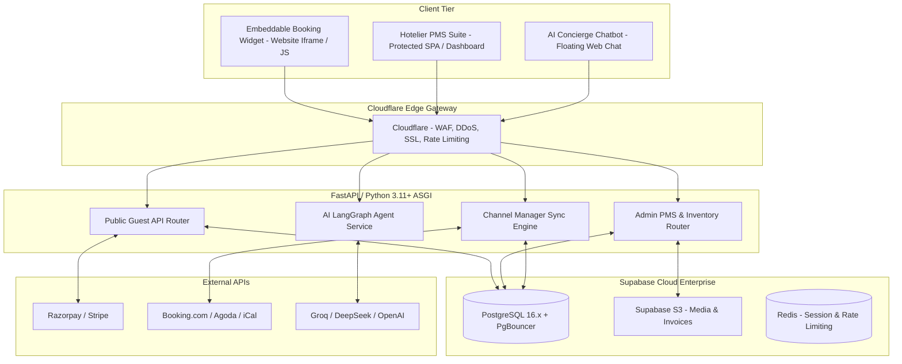
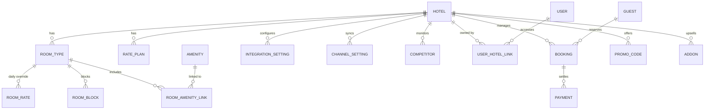
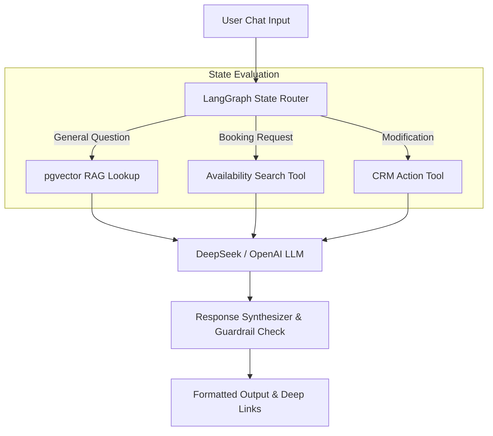

# STAYBOOKER AI — MASTER SYSTEM DOCUMENTATION

**Version:** 4.0-MASTER-ENTERPRISE
**Classification:** Confidential / Definitive Architecture & API Specification
**Audience:** CTO, VP Engineering, Solution Architects, Security Teams, Product Managers

---

## TABLE OF CONTENTS

1. [System Architecture](#1-system-architecture)
2. [Database Schema & ERD](#2-database-schema--erd)
3. [Security & Authentication](#3-security--authentication)
4. [REST API Reference (26 Routers)](#4-rest-api-reference)
5. [Frontend Architecture](#5-frontend-architecture)
6. [AI Concierge & RAG Graph](#6-ai-concierge--rag-graph)
7. [Production Deployment](#7-production-deployment)

---

## 1. SYSTEM ARCHITECTURE

### 1.1 Overview

**Staybooker.ai** is an enterprise-grade, multi-tenant AI-powered Hotel Booking Engine, Property Management Suite (PMS), and Channel Management Distribution Hub. It replaces fragmented legacy hospitality platforms with:

- Fully customizable direct booking widgets
- Real-time rate shopping
- Automated OTA channel synchronization (XML/iCal)
- Autonomous AI concierge powered by LangGraph + LLMs

### 1.2 Architectural Principles

- **Strict Decoupling**: Hotelier PMS operations are completely isolated from guest-facing booking funnels so admin reporting/OTA sync never degrades consumer performance.
- **Async-First**: All I/O (DB, LLM, OTA) is fully async via Python `asyncpg` + FastAPI ASGI.
- **Multi-Tenant Isolation**: Row-Level Security (RLS) enforced at the PostgreSQL layer — no tenant can ever read another's data.

### 1.3 Full System Topology



### 1.4 Core Technology Stack

| Layer | Technology |
|-------|-----------|
| **API Framework** | FastAPI v0.110+ · Uvicorn/Gunicorn ASGI |
| **Validation** | Pydantic v2.0+ |
| **ORM** | SQLModel (SQLAlchemy 2.0 async) |
| **Database** | PostgreSQL 16.x on Supabase Enterprise |
| **Vector Search** | pgvector (RAG embeddings) |
| **Frontend** | Vite · React 18 · TypeScript 5.2 · Tailwind CSS 3.4 · Shadcn UI |
| **State Management** | TanStack Query v5 · React Context API |
| **Runtime** | Python 3.11+ · Node.js 20.x |

---

## 2. DATABASE SCHEMA & ERD

### 2.1 Entity-Relationship Diagram



### 2.2 Table DDLs

#### `hotels`
```sql
CREATE TABLE hotels (
    id UUID PRIMARY KEY DEFAULT gen_random_uuid(),
    name VARCHAR(255) NOT NULL,
    slug VARCHAR(100) UNIQUE NOT NULL,
    email VARCHAR(255) NOT NULL,
    phone VARCHAR(50) NOT NULL,
    address TEXT,
    city VARCHAR(100),
    country VARCHAR(100) DEFAULT 'India',
    currency VARCHAR(10) DEFAULT 'INR',
    primary_color VARCHAR(30) DEFAULT '#2563EB',
    logo_url TEXT,
    check_in_time VARCHAR(20) DEFAULT '14:00',
    check_out_time VARCHAR(20) DEFAULT '11:00',
    is_active BOOLEAN DEFAULT TRUE,
    feature_rate_shopper BOOLEAN DEFAULT FALSE,
    feature_ai_agent BOOLEAN DEFAULT FALSE,
    feature_guest_bot BOOLEAN DEFAULT FALSE,
    created_at TIMESTAMP WITH TIME ZONE DEFAULT CURRENT_TIMESTAMP,
    updated_at TIMESTAMP WITH TIME ZONE DEFAULT CURRENT_TIMESTAMP
);
CREATE INDEX idx_hotels_slug ON hotels(slug);
```

#### `users`
```sql
CREATE TABLE users (
    id UUID PRIMARY KEY REFERENCES auth.users(id) ON DELETE CASCADE,
    email VARCHAR(255) UNIQUE NOT NULL,
    full_name VARCHAR(255),
    role VARCHAR(50) DEFAULT 'OWNER', -- OWNER, MANAGER, STAFF, SUPER_ADMIN
    is_superadmin BOOLEAN DEFAULT FALSE,
    created_at TIMESTAMP WITH TIME ZONE DEFAULT CURRENT_TIMESTAMP
);
CREATE INDEX idx_users_email ON users(email);
```

#### `user_hotel_links`
```sql
CREATE TABLE user_hotel_links (
    id UUID PRIMARY KEY DEFAULT gen_random_uuid(),
    user_id UUID NOT NULL REFERENCES users(id) ON DELETE CASCADE,
    hotel_id UUID NOT NULL REFERENCES hotels(id) ON DELETE CASCADE,
    role VARCHAR(50) NOT NULL DEFAULT 'MANAGER',
    created_at TIMESTAMP WITH TIME ZONE DEFAULT CURRENT_TIMESTAMP,
    UNIQUE(user_id, hotel_id)
);
CREATE INDEX idx_user_hotel_links_user ON user_hotel_links(user_id);
```

#### `room_types`
```sql
CREATE TABLE room_types (
    id UUID PRIMARY KEY DEFAULT gen_random_uuid(),
    hotel_id UUID NOT NULL REFERENCES hotels(id) ON DELETE CASCADE,
    name VARCHAR(255) NOT NULL,
    description TEXT,
    base_price NUMERIC(12, 2) NOT NULL,
    extra_person_price NUMERIC(12, 2) DEFAULT 1000.0,
    extra_child_price NUMERIC(12, 2) DEFAULT 500.0,
    total_inventory INTEGER NOT NULL DEFAULT 1,
    base_occupancy INTEGER NOT NULL DEFAULT 2,
    max_occupancy INTEGER NOT NULL DEFAULT 3,
    max_children INTEGER NOT NULL DEFAULT 2,
    size_sqm INTEGER,
    bed_type VARCHAR(100) DEFAULT 'King Bed',
    view_type VARCHAR(100) DEFAULT 'City View',
    amenities JSONB DEFAULT '[]'::jsonb,
    is_active BOOLEAN DEFAULT TRUE,
    created_at TIMESTAMP WITH TIME ZONE DEFAULT CURRENT_TIMESTAMP
);
CREATE INDEX idx_room_types_hotel ON room_types(hotel_id);
```

#### `rate_plans`
```sql
CREATE TABLE rate_plans (
    id UUID PRIMARY KEY DEFAULT gen_random_uuid(),
    hotel_id UUID NOT NULL REFERENCES hotels(id) ON DELETE CASCADE,
    name VARCHAR(255) NOT NULL,
    description TEXT,
    meal_plan VARCHAR(20) NOT NULL DEFAULT 'EP', -- EP, CP, MAP, AP
    price_adjustment NUMERIC(12, 2) NOT NULL DEFAULT 0.00,
    is_refundable BOOLEAN NOT NULL DEFAULT TRUE,
    cancellation_hours INTEGER DEFAULT 24,
    min_los INTEGER DEFAULT 1,
    max_los INTEGER DEFAULT 30,
    advance_purchase_days INTEGER DEFAULT 0,
    inclusions JSONB DEFAULT '["Free Wi-Fi"]'::jsonb,
    is_package BOOLEAN DEFAULT FALSE,
    is_active BOOLEAN DEFAULT TRUE,
    created_at TIMESTAMP WITH TIME ZONE DEFAULT CURRENT_TIMESTAMP
);
CREATE INDEX idx_rate_plans_hotel ON rate_plans(hotel_id);
```

#### `room_rates` (Daily Pricing Overrides)
```sql
CREATE TABLE room_rates (
    id UUID PRIMARY KEY DEFAULT gen_random_uuid(),
    hotel_id UUID NOT NULL REFERENCES hotels(id) ON DELETE CASCADE,
    room_type_id UUID NOT NULL REFERENCES room_types(id) ON DELETE CASCADE,
    rate_plan_id UUID REFERENCES rate_plans(id) ON DELETE CASCADE,
    date_from DATE NOT NULL,
    date_to DATE NOT NULL,
    price NUMERIC(12, 2) NOT NULL,
    created_at TIMESTAMP WITH TIME ZONE DEFAULT CURRENT_TIMESTAMP
);
CREATE INDEX idx_room_rates_lookup ON room_rates(hotel_id, room_type_id, date_from, date_to);
```

#### `bookings`
```sql
CREATE TABLE bookings (
    id UUID PRIMARY KEY DEFAULT gen_random_uuid(),
    hotel_id UUID NOT NULL REFERENCES hotels(id) ON DELETE CASCADE,
    guest_id UUID NOT NULL REFERENCES guests(id),
    booking_number VARCHAR(50) UNIQUE NOT NULL,
    check_in DATE NOT NULL,
    check_out DATE NOT NULL,
    rooms JSONB NOT NULL,
    addons JSONB DEFAULT '[]'::jsonb,
    special_requests TEXT,
    promo_code VARCHAR(50),
    subtotal NUMERIC(12, 2) NOT NULL,
    tax_amount NUMERIC(12, 2) NOT NULL DEFAULT 0.00,
    total_amount NUMERIC(12, 2) NOT NULL,
    amount_paid NUMERIC(12, 2) DEFAULT 0.00,
    status VARCHAR(50) NOT NULL DEFAULT 'PENDING',
    -- PENDING, CONFIRMED, CHECKED_IN, CHECKED_OUT, CANCELLED
    channel_source VARCHAR(50) DEFAULT 'DIRECT',
    -- DIRECT, BOOKING_COM, AGODA, AIRBNB
    created_at TIMESTAMP WITH TIME ZONE DEFAULT CURRENT_TIMESTAMP
);
CREATE INDEX idx_bookings_hotel_dates ON bookings(hotel_id, check_in, check_out);
```

#### `integration_settings`
```sql
CREATE TABLE integration_settings (
    id UUID PRIMARY KEY DEFAULT gen_random_uuid(),
    hotel_id UUID UNIQUE NOT NULL REFERENCES hotels(id) ON DELETE CASCADE,
    widget_primary_color VARCHAR(30),
    widget_logo_url TEXT,
    widget_custom_domain VARCHAR(255),
    allowed_domains TEXT,
    widget_enabled BOOLEAN DEFAULT TRUE,
    ai_provider VARCHAR(50) DEFAULT 'groq',
    ai_model VARCHAR(100) DEFAULT 'llama3-70b-8192',
    ai_api_key TEXT,
    created_at TIMESTAMP WITH TIME ZONE DEFAULT CURRENT_TIMESTAMP
);
```

### 2.3 Row-Level Security (RLS) & Multi-Tenant Scoping

All tables enforce Supabase PostgreSQL RLS policies. Users can only access data for hotels they are linked to.

```sql
-- Example: RLS for room_types
ALTER TABLE room_types ENABLE ROW LEVEL SECURITY;

CREATE POLICY room_types_tenant_policy ON room_types
    FOR ALL
    USING (
        hotel_id IN (
            SELECT hotel_id FROM user_hotel_links WHERE user_id = auth.uid()
        )
    );
```

---

## 3. SECURITY & AUTHENTICATION

### 3.1 JWT Flow (Supabase Auth / GoTrue)

1. Client sends credentials → `/auth/v1/token`
2. Supabase issues asymmetric JWT (`sub`, `email`, `app_metadata`)
3. FastAPI validates JWT via `Depends(get_current_user)` on every protected request

### 3.2 RBAC Hierarchy

```
[ SUPER_ADMIN ]   → Unrestricted global access across all hotels & billing
      ↓
[ OWNER ]         → Full CRUD on owned properties, team management, billing
      ↓
[ MANAGER ]       → Inventory CRUD, rates, channel sync, bookings
      ↓
[ STAFF ]         → Read-only inventory, check-in/out execution
```

### 3.3 Multi-Property Permission Check

```python
async def check_hotel_permission(hotel_id: str, user: User = Depends(get_current_user)):
    if user.is_superadmin:
        return True
    link = await session.execute(
        select(UserHotelLink).where(
            UserHotelLink.user_id == user.id,
            UserHotelLink.hotel_id == hotel_id
        )
    )
    if not link.scalar_one_or_none():
        raise HTTPException(status_code=403, detail="Access denied for this property")
```

---

## 4. REST API REFERENCE

**Base URL:** `https://api.staybooker.ai/api/v1`
**Auth Header:** `Authorization: Bearer <JWT>`
**Hotel Context:** `X-Hotel-ID: <UUID>`

---

### 4.1 Authentication & Users

| Method | Endpoint | Description |
|--------|----------|-------------|
| `GET` | `/auth/me` | Current user identity & role |
| `GET` | `/users` | List users for organization |
| `POST` | `/users/invite` | Invite staff member |

**`GET /auth/me` Response:**
```json
{
  "id": "ebdfd346-cc5f-4b04-83bb-2537b0e437be",
  "email": "tech@hotel.com",
  "full_name": "Hotel Manager",
  "role": "OWNER",
  "is_superadmin": false,
  "created_at": "2026-05-18T10:00:00Z"
}
```

---

### 4.2 Property Management

| Method | Endpoint | Description |
|--------|----------|-------------|
| `GET` | `/properties` | List all hotel properties |
| `GET` | `/hotels/{hotel_id}` | Get detailed property config |
| `PUT` | `/hotels/{hotel_id}` | Update hotel metadata & branding |

**`PUT /hotels/{hotel_id}` Payload:**
```json
{
  "name": "Grand Plaza Premium Spa",
  "phone": "+91 98765 43210",
  "primary_color": "#6D28D9",
  "check_in_time": "15:00"
}
```

---

### 4.3 Inventory — Rooms & Amenities

| Method | Endpoint | Description |
|--------|----------|-------------|
| `GET` | `/rooms` | List room categories |
| `POST` | `/rooms` | Create room category |
| `PUT` | `/rooms/{room_id}` | Update room |
| `DELETE` | `/rooms/{room_id}` | Deactivate room |
| `GET` | `/amenities` | List amenities |
| `POST` | `/amenities` | Create amenity |

**`POST /rooms` Payload:**
```json
{
  "hotel_id": "3815e471-...",
  "name": "Presidential Penthouse",
  "description": "Luxurious top-floor penthouse with private jacuzzi.",
  "base_price": 25000.00,
  "total_inventory": 2,
  "base_occupancy": 2,
  "max_occupancy": 6,
  "size_sqm": 120,
  "amenities": ["Private Jacuzzi", "Butler Service", "Sea View"]
}
```

---

### 4.4 Rate Engine & Pricing

| Method | Endpoint | Description |
|--------|----------|-------------|
| `GET` | `/rates/plans` | List rate plans (EP, CP, MAP, packages) |
| `POST` | `/rates/plans` | Create rate plan / package |
| `POST` | `/rates/overrides` | Set daily pricing override |
| `GET` | `/promos` | List promo codes |
| `POST` | `/promos` | Create promo code |
| `GET` | `/addons` | List upsell items |
| `POST` | `/addons` | Create addon |

**`POST /rates/overrides` — Holiday/Weekend Surge:**
```json
{
  "hotel_id": "3815e471-...",
  "room_type_id": "7a29e84b-...",
  "date_from": "2026-12-24",
  "date_to": "2026-12-31",
  "price": 14500.00
}
```
**Response:** `{ "status": "Rates updated successfully across 8 nights" }`

---

### 4.5 Availability & Rate Calculation

| Method | Endpoint | Description |
|--------|----------|-------------|
| `GET` | `/availability/calendar` | 30-day inventory matrix for PMS grid |
| `GET` | `/competitors` | Live OTA competitor rate shopper |

**`GET /availability/calendar` Response:**
```json
{
  "hotel_id": "3815e471-...",
  "matrix": {
    "2026-06-01": {
      "7a29e84b-...": { "available": 8, "booked": 2, "blocked": 0, "current_price": 7500.00 }
    }
  }
}
```

---

### 4.6 Booking Engine & Reservation Lifecycle

| Method | Endpoint | Description |
|--------|----------|-------------|
| `GET` | `/public/hotels/{slug}` | Public hotel branding (no auth) |
| `GET` | `/public/hotels/{slug}/rooms` | **Core search engine** — availability + rates |
| `POST` | `/public/bookings` | Create guest reservation |
| `GET` | `/bookings` | List bookings (PMS) |
| `GET` | `/bookings/{id}` | Get booking detail |
| `POST` | `/bookings/{id}/checkin` | Check-in transition |
| `POST` | `/bookings/{id}/checkout` | Check-out transition |
| `POST` | `/bookings/{id}/cancel` | Cancel booking |

**`GET /public/hotels/{slug}/rooms` Query Params:**
```
check_in=2026-05-19&check_out=2026-05-21&guests=2&adults=2&children=0&rooms=1
```

**Response:**
```json
[
  {
    "id": "7a29e84b-...",
    "name": "Executive Suite",
    "available_rooms": 10,
    "rate_options": [
      {
        "id": "virtual-standard-...",
        "name": "Standard Rate",
        "meal_plan_code": "EP",
        "price_per_night": 7500.00,
        "total_price": 15000.00,
        "inclusions": ["Free Wi-Fi"],
        "is_refundable": true,
        "cancellation_policy": "Free cancellation up to 24 hours before check-in"
      }
    ]
  }
]
```

**`POST /public/bookings` Payload:**
```json
{
  "check_in": "2026-05-19",
  "check_out": "2026-05-21",
  "rooms": [
    {
      "room_type_id": "7a29e84b-...",
      "rate_plan_id": "virtual-standard-...",
      "guests": 2,
      "total_price": 15000.00
    }
  ],
  "addons": [],
  "guest": {
    "first_name": "John",
    "last_name": "Doe",
    "email": "john.doe@example.com",
    "phone": "+91 9876543210"
  }
}
```
**Response:** `{ "booking_number": "BK20260519ABC123", "status": "PENDING" }`

---

### 4.7 Payments

| Method | Endpoint | Description |
|--------|----------|-------------|
| `GET` | `/payments` | List payment records |
| `POST` | `/payments/initiate` | Create Razorpay / Stripe order token |

---

### 4.8 Channel Manager

| Method | Endpoint | Description |
|--------|----------|-------------|
| `GET` | `/channel-manager/settings` | Get OTA channel config |
| `POST` | `/channel-manager/sync` | Trigger async OTA push (XML/iCal) |

---

### 4.9 AI Concierge

| Method | Endpoint | Description |
|--------|----------|-------------|
| `POST` | `/public/chat/guest` | Guest chatbot (streaming LangGraph) |
| `POST` | `/agent/action` | Hotelier AI assistant |

**`POST /public/chat/guest` Payload:**
```json
{
  "hotel_slug": "grand-plaza",
  "message": "Do you have rooms for 2 people tomorrow?",
  "history": []
}
```
**Response:**
```json
{
  "response": "Yes! Executive Suites available from ₹7,500. [Book here](/book/grand-plaza/rooms?check_in=2026-05-20&check_out=2026-05-21)"
}
```

---

### 4.10 Analytics & Dashboards

| Method | Endpoint | Description |
|--------|----------|-------------|
| `GET` | `/dashboard/summary` | Revenue, Occupancy %, ADR, RevPAR |
| `GET` | `/reports` | CSV/PDF financial statements & invoices |
| `GET` | `/notifications` | Real-time front desk feed |
| `GET` | `/leads` | B2B corporate & wedding CRM |
| `POST` | `/upload` | Pre-signed S3 URL for photos/IDs |
| `GET` | `/admin` | System monitoring & feature toggles |
| `GET` | `/superadmin` | Global tenant management |

---

## 5. FRONTEND ARCHITECTURE

### 5.1 Route Structure

```
[ Root App Router ]
       │
       ├── /dashboard              Hotelier PMS Portal (Protected)
       ├── /rooms                  Inventory Matrix
       ├── /bookings               Kanban / Table View
       ├── /analytics              Revenue & Occupancy Reports
       ├── /settings/integration   Widget Customizer & CNAME
       │
       └── /book/:slug/            Guest Booking Funnel (Public - Always Light Mode)
               ├── /rooms          BookingSelection.tsx — Room list + Stepper
               ├── /checkout       BookingCheckout.tsx — Guest Form + Addons
               └── /confirmation   BookingConfirmation.tsx — Invoice
```

### 5.2 State Management (TanStack Query)

```typescript
const queryKeys = {
  hotel: (slug: string) => ['hotel', slug] as const,
  rooms: (hotelId: string) => ['rooms', hotelId] as const,
  bookings: (hotelId: string, filter: any) => ['bookings', hotelId, filter] as const,
};

export function useRooms(hotelId: string) {
  return useQuery({
    queryKey: queryKeys.rooms(hotelId),
    queryFn: () => apiClient.get(`/rooms`, { headers: { 'X-Hotel-ID': hotelId } }),
    enabled: !!hotelId,
  });
}
```

### 5.3 Embeddable Booking Widget

Paste this snippet into any WordPress / Webflow site:

```html
<div id="staybooker-widget" data-hotel-slug="grand-plaza" data-layout="modern"></div>
<script src="https://staybooker.ai/widget-v3.js" async></script>
```

**How it works:**
- Script injects an `<iframe>` → `https://staybooker.ai/book/grand-plaza/widget`
- **Dynamic Resizing**: Widget sends `postMessage({ type: 'RESIZE', height })` to parent on state changes (calendar open, etc.)
- **Custom Branding**: Widget fetches `/widget-config` on mount and applies hotel's `primary_color` to CSS variables instantly

---

## 6. AI CONCIERGE & RAG GRAPH

### 6.1 LangGraph State Machine



### 6.2 Routing Logic

| Guest Input | Graph Route | Action |
|-------------|------------|--------|
| *"Are pets allowed?"* | RAG Knowledge Node | Retrieves hotel policy via pgvector |
| *"Book a suite for 2 nights next Monday"* | Tool Call Node | Calls `/availability`, returns booking deep link |
| *"Change my booking dates"* | CRM Tool Node | Updates booking notes in PMS |

### 6.3 Vector Embeddings

Hotel policies, FAQs, and room descriptions are embedded using `pgvector` in Supabase. On each query, the guest's message is embedded and a cosine-similarity search retrieves the top-K relevant documents before passing to the LLM.

---

## 7. PRODUCTION DEPLOYMENT

### 7.1 Infrastructure Topology

```
[ Cloudflare DNS + WAF ]
         │
         ├── Static SPA (Vite Build) → Cloudflare Pages
         │
         └── API Gateway → Load Balancer
                    │
         ┌──────────┴──────────┐
         ▼                     ▼
  Uvicorn Worker 1      Uvicorn Worker 2
  (0.0.0.0:8000)        (0.0.0.0:8000)
         │                     │
         └──────────┬──────────┘
                    ▼
           PgBouncer (Port 6543)
           Transaction Pooling Mode
                    │
                    ▼
         Supabase PostgreSQL 16
```

### 7.2 Dockerfile (Backend)

```dockerfile
FROM python:3.11-slim as builder
WORKDIR /app
RUN apt-get update && apt-get install -y --no-install-recommends build-essential libpq-dev
COPY requirements.txt .
RUN pip wheel --no-cache-dir --no-deps --wheel-dir /app/wheels -r requirements.txt

FROM python:3.11-slim
WORKDIR /app
COPY --from=builder /app/wheels /wheels
COPY --from=builder /app/requirements.txt .
RUN pip install --no-cache /wheels/*
COPY . .
ENV PYTHONUNBUFFERED=1 PORT=8000 WORKERS=4
EXPOSE 8000
CMD ["sh", "-c", "uvicorn app.main:app --host 0.0.0.0 --port ${PORT} --workers ${WORKERS} --forwarded-allow-ips='*'"]
```

### 7.3 Database Connection Pooling

```python
# app/core/database.py
engine = create_async_engine(
    settings.DATABASE_URL,  # PgBouncer port 6543
    echo=False,
    future=True,
    pool_size=20,
    max_overflow=10,
    pool_timeout=30,
    pool_recycle=1800
)
```

> **Important:** Always connect via PgBouncer port `6543` (Transaction Pooling Mode) — **not** the direct Postgres port `5432`. This supports thousands of concurrent guest widget connections without exhausting PostgreSQL's connection limit.

### 7.4 Monitoring & Recovery

| Concern | Solution |
|---------|---------|
| **Metrics** | OpenTelemetry → Prometheus → Grafana |
| **Logs** | Structured JSON → Datadog / AWS CloudWatch |
| **Backups** | Supabase PITR — 5-minute RPO window |
| **Uptime** | Railway auto-restart + Cloudflare health checks |

---

**[END OF DOCUMENTATION — Staybooker AI v4.0]**
